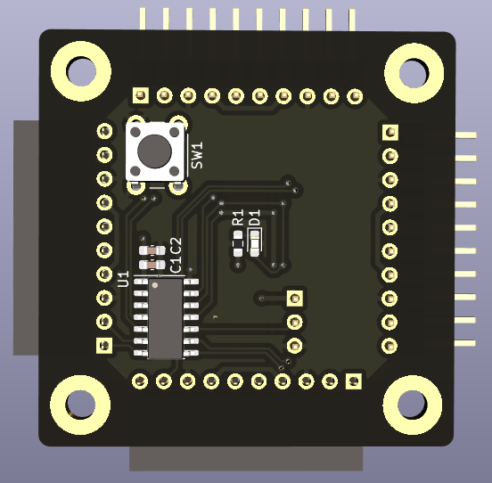
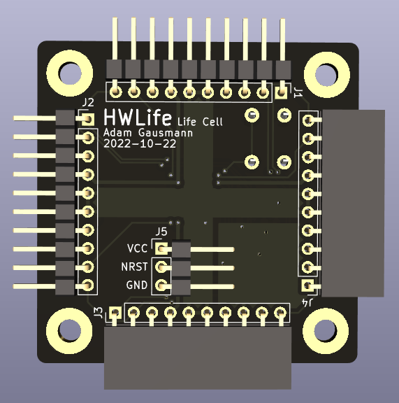

# Life Cell

A tileable Life processor, implementing a single cell per tile.

## Future improvements

- Current connectors are bulky, size could be reduced significantly if I use
more low-profile ones.

- Connector pinouts are rotationally symmetric, so board orientation doesn't matter. However, this is limited by having gendered connectors. Hermaphroditic connectors would be cool but more expensive...

- Cost efficiency ($ per cell) of this design is not optimal. Alternative
design possibilities:

  - Backplane design for distributing power and clock and routing states between
  neighbors, modules only contain logic and state. This would reduce the
  connector size, number of connectors, and complexity of modules.

  - Combining multiple cells into a single module. The MCU is one of the main
  factors in the overall cost per cell, so the goal would be to maximize the
  utilization of the MCU by increasing the number of cells it processes per
  generation.